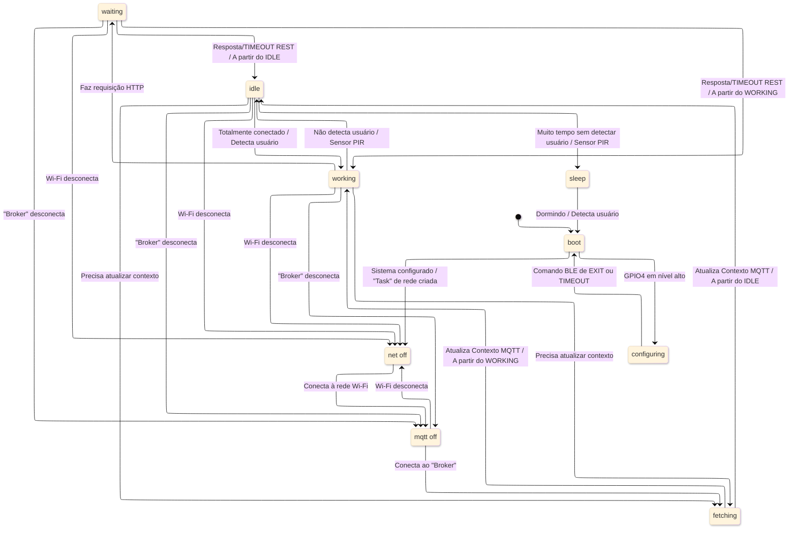

# DOCS

## Finite State Machine (FSM) do ESP32CAM

```mermaid
---
config:
  layout: elk
  theme: base
  look: neo
---
stateDiagram
  direction TB
  [*] --> boot
  boot --> net_off:Sistema configurado / "Task" de rede criada
  net_off --> mqtt_off:Conecta à rede Wi-Fi
  mqtt_off --> net_off:Wi-Fi desconecta
  mqtt_off --> fetching:Conecta ao "Broker"
  fetching --> working:Atualiza Contexto MQTT / A partir do WORKING
  fetching --> idle:Atualiza Contexto MQTT / A partir do IDLE
  working --> fetching:Precisa atualizar contexto
  idle --> fetching:Precisa atualizar contexto
  working --> waiting:Faz requisição HTTP
  waiting --> working:Resposta/TIMEOUT REST / A partir do WORKING
  waiting --> idle:Resposta/TIMEOUT REST / A partir do IDLE
  working --> idle:Não detecta usuário / Sensor PIR
  idle --> working:Totalmente conectado / Detecta usuário
  idle --> sleep:Muito tempo sem detectar usuário / Sensor PIR
  sleep --> boot:Dormindo / Detecta usuário
  boot --> configuring:GPIO4 em nível alto
  configuring --> boot:Comando BLE de EXIT ou TIMEOUT
  working --> mqtt_off:"Broker" desconecta
  idle --> mqtt_off:"Broker" desconecta
  waiting --> mqtt_off:"Broker" desconecta
  working --> net_off:Wi-Fi desconecta
  idle --> net_off:Wi-Fi desconecta
  waiting --> net_off:Wi-Fi desconecta
  net_off:net off
  mqtt_off:mqtt off
```
