<a id="topo"></a>

[![DOI][doi-shield]][doi-url]
[![Contributors][contributors-shield]][contributors-url]
[![Forks][forks-shield]][forks-url]
[![Stargazers][stars-shield]][stars-url]
[![Issues][issues-shield]][issues-url]
[![LinkedIn][linkedin-shield]][linkedin-url]

<!-- PROJECT LOGO -->
<br />
<div align="center">
  <a href="https://github.com/DanielKGM/autoponto-firmware">
    
  </a>

<h3 align="center">Chamadas Acadêmicas por Reconhecimento Facial</h3><br />
  <p align="center">
    <strong>AutoPonto</strong> é um sistema distribuído de computação de borda composto por três repositórios: código de <i>firmware</i>, aplicação <i>web</i> e servidor de borda. O objetivo é criar uma solução <b>barata</b> e <b>escalável</b> para automatização de chamadas acadêmicas através do reconhecimento facial, utilizando camadas independentes e conectadas por uma rede local. 
    <br /><br />
    <u>Este repositório</u> guarda o código-fonte do <i>firmware</i> dos dispositivos embarcados que são posicionados em salas de aula, responsáveis por coletar dados e interagir com usuários.
    <br />
    <br />
    <a href="https://github.com/DanielKGM/autoponto">Servidor Principal</a>
    &middot;
    <a href="https://github.com/DanielKGM/autoponto-edgenode">AutoPonto <i>EdgeNode</i></a>
    &middot;
    <a href="https://github.com/DanielKGM/autoponto-firmware/issues/new?labels=bug&template=bug-report---.md">Reportar Erro</a>
    &middot;
    <a href="https://github.com/DanielKGM/autoponto-firmware/issues/new?labels=enhancement&template=feature-request---.md">Sugerir Algo</a>
  </p>
</div>

<!-- TABLE OF CONTENTS -->
<details>
  <summary>Sumário</summary>
  <ol>
    <li><a href="#arquitetura-geral">Arquitetura Geral</a></li>
    <li><a href="#lista-de-materiais">Lista de Materiais</a></li>
    <li><a href="#esquema-elétrico-do-dispositivo">Esquema Elétrico do Dispositivo</a></li>
    <li><a href="#objetivos-específicos">Objetivos Específicos</a></li>
    <li><a href="#fluxo-de-execução">Fluxo de Execução</a></li>
    <li><a href="#estados-do-dispositivo">Estados do Dispositivo</a></li>
    <li><a href="#dependências-do-firmware">Dependências do <i>Firmware</i></a></li>
    <li><a href="#placa-de-circuito-impresso">Placa de Circuito Impresso</a></li>
    <li><a href="#caixa-de-montagem">Caixa de Montagem</a></li>
    <li><a href="#fotos-em-funcionamento">Fotos em Funcionamento</a></li>
    <li><a href="#configuração-local">Configuração Local</a></li>
    <li><a href="#mapa-de-arquivos">Mapa de Arquivos</a></li>
    <li><a href="#contexto-de-aula">Contexto de Aula</a></li>
    <li>
      <a href="#contrato-rest">Contrato <i>REST</i></a>
      <ul>
        <li><a href="#buscar-contexto">Buscar Contexto</a></li>
        <li><a href="#enviar-frame">Enviar <i>Frame</i></a></li>
      </ul>
    </li>
    <li>
      <a href="#contrato-mqtt">Contrato <i>MQTT</i></a>
      <ul>
        <li><a href="#status"><i>Status</i></a></li>
        <li><a href="#métricas">Métricas</a></li>
      </ul>
    </li>
    <li><a href="#contato">Contato</a></li>
    <li><a href="#licença-e-citação">Licença e Citação</a></li>
    <li><a href="#agradecimentos">Agradecimentos</a></li>
  </ol>
</details>

## Arquitetura Geral


<p align="justify">Quanta coisa é preciso para automatizar chamadas acadêmicas? Por exemplo, informações sobre o curso e rostos de alunos precisam ser cadastrados; então, em sala de aula, fotos precisam ser capturadas e capturas precisam ser processadas. Para atingir esses e (muitos) outros objetivos, o projeto utiliza uma arquitetura distribuída chamada <a href="https://www.intel.com/content/www/us/en/learn/what-is-edge-computing.html">computação de borda</a>. Isso permite diluir um monte de funcionalidades em camadas independentes, mas cooperativas:</p>
<ul>
<li><b>Dispositivos Embarcados</b> (este repositório): dispositivos eletrônicos posicionados em salas de aula. Eles são responsáveis por capturar fotos e exibir mensagens, portanto, interagem frequente e diretamente com os usuários;</li>
<li><b><a href="https://github.com/DanielKGM/autoponto-edgenode">Nó de Borda</a></b>: servidor intermediário implementado em <i>Raspberry Pi 4</i> ou outros <i>Single Board Computer</i> (<i>SBC</i>), seu propósito é fazer o reconhecimento facial, conectar os dispositivos embarcados com o servidor principal e armazenar uma parte <b>relevante</b> dos dados a cada sincronização (como rostos, aulas, alunos, matrículas, etc.);</li>
<li><b><a href="https://github.com/DanielKGM/autoponto">Servidor Principal</a></b>: regras de negócio, gerenciamento de usuários, persistência de dados, coleta biométrica, interface <i>web</i>, <i>dashboards</i>, relatórios, formulários <i>CRUD</i>, sincronização com nós, mapa <i>IoT</i>.</li>
<li><b><a href="https://github.com/DanielKGM/Playground_InterSCity">InterSCity</a></b> (opcional): trata-se de um <i>middleware IoT</i> feito por pesquisadores brasileiros da USP, onde métricas e <i>status</i> dos dispositivos podem ser publicados (pelos nós) e lidos (por aplicações). Não é necessário para o funcionamento do projeto, mas altamente recomendado como camada de <u>telemetria e monitoramento</u>.</li>
</ul>
<br/>
<p align="right">(<a href="#topo">voltar ao topo</a>)</p>

## Lista de Materiais

|                         Imagem                         | Componente <i>THT</i>                                                                                                                                                                                                                                                                                                                                                                                                                                                                                                                                                                                                                                                                                 | Especificação                                                        | Quantidade |
| :----------------------------------------------------: | :---------------------------------------------------------------------------------------------------------------------------------------------------------------------------------------------------------------------------------------------------------------------------------------------------------------------------------------------------------------------------------------------------------------------------------------------------------------------------------------------------------------------------------------------------------------------------------------------------------------------------------------------------------------------------------------------------- | :------------------------------------------------------------------- | :--------: |
|  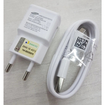   | [Fonte de alimentação](<[URL_ALIEXPRESS_AQUI](https://www.mercadolivre.com.br/carregador-samsung-epta50bw-j6-j8-a6-plus-e5-de-15-ampere-fabricado-no-brasil/p/MLB19713348#polycard_client=search-desktop&be_origin=backend&overlay_label=not_apply&search_layout=grid&position=5&type=product&tracking_id=b3a82e5a-dd66-4995-a2e6-63e6c314adde&wid=MLB6292712606&sid=search)>)                                                                                                                                                                                                                                                                                                                        | Samsung EP-TA50BW, saída 5 Vcc e corrente máxima de 1,55 A           |     1      |
|   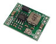   | [Conversor de tensão](https://pt.aliexpress.com/item/1005007653423578.html?spm=a2g0o.productlist.main.1.177e1vNJ1vNJXa&algo_pvid=62bb8e84-95f6-43c5-a440-43cf7702cb3b&algo_exp_id=62bb8e84-95f6-43c5-a440-43cf7702cb3b-0&pdp_ext_f=%7B%22order%22%3A%22562%22%2C%22spu_best_type%22%3A%22price%22%2C%22eval%22%3A%221%22%2C%22fromPage%22%3A%22search%22%7D&pdp_npi=6%40dis%21BRL%2115.45%2115.45%21%21%212.79%212.79%21%402101de2517853740269317086e0db9%2112000041666444430%21sea%21BR%212683287780%21X%211%210%21n_tag%3A-29919%3Bd%3A24cb7d84%3Bm03_new_user%3A-29895&curPageLogUid=ByRwubS4BuFQ&utparam-url=scene%3Asearch%7Cquery_from%3A%7Cx_object_id%3A1005007653423578%7C_p_origin_prod%3A) | MP1584, conversor <i>buck</i>, saída ajustada para 3,3 V             |     1      |
|   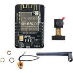    | [Microcontrolador com câmera](https://www.aliexpress.com/item/1005006967566203.html)                                                                                                                                                                                                                                                                                                                                                                                                                                                                                                                                                                                                                  | <i>ESP32-CAM</i> AI-Thinker                                          |     1      |
| 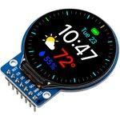 | [Módulo de <i>display</i>](https://pt.aliexpress.com/item/1005009766462228.html)                                                                                                                                                                                                                                                                                                                                                                                                                                                                                                                                                                                                                      | <i>TFT</i> circular 1,28'', controlador GC9A01, interface <i>SPI</i> |     1      |
|   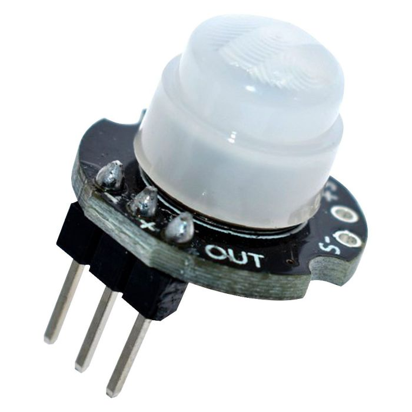    | [Sensor de presença](https://pt.aliexpress.com/item/32946280844.html)                                                                                                                                                                                                                                                                                                                                                                                                                                                                                                                                                                                                                                 | HC-SR602, sensor <i>PIR</i> de movimento                             |     1      |
|                           -                            | <i>Buzzer</i> ativo                                                                                                                                                                                                                                                                                                                                                                                                                                                                                                                                                                                                                                                                                   | TMB12A03, alimentação nominal de 3 V                                 |     1      |
|                           -                            | Transistor <i>NPN</i>                                                                                                                                                                                                                                                                                                                                                                                                                                                                                                                                                                                                                                                                                 | S9013, usado no chaveamento do <i>display</i> e do indicador         |     2      |
|                           -                            | Diodo <i>Schottky</i>                                                                                                                                                                                                                                                                                                                                                                                                                                                                                                                                                                                                                                                                                 | 1N5819, usado na proteção de alimentação e no circuito do IO4        |     2      |
|                           -                            | <i>LED</i> verde                                                                                                                                                                                                                                                                                                                                                                                                                                                                                                                                                                                                                                                                                      | Indicador visual de retorno positivo                                 |     1      |
|                           -                            | <i>LED</i> azul                                                                                                                                                                                                                                                                                                                                                                                                                                                                                                                                                                                                                                                                                       | Indicador visual de alimentação                                      |     1      |
|                           -                            | Resistor                                                                                                                                                                                                                                                                                                                                                                                                                                                                                                                                                                                                                                                                                              | 220 Ω                                                                |     1      |
|                           -                            | Resistor                                                                                                                                                                                                                                                                                                                                                                                                                                                                                                                                                                                                                                                                                              | 1 kΩ                                                                 |     3      |
|                           -                            | Resistor                                                                                                                                                                                                                                                                                                                                                                                                                                                                                                                                                                                                                                                                                              | 4,7 kΩ                                                               |     1      |
|                           -                            | Resistor                                                                                                                                                                                                                                                                                                                                                                                                                                                                                                                                                                                                                                                                                              | 10 kΩ                                                                |     2      |
|                           -                            | Resistor                                                                                                                                                                                                                                                                                                                                                                                                                                                                                                                                                                                                                                                                                              | 20 kΩ                                                                |     1      |
|                           -                            | Capacitor cerâmico                                                                                                                                                                                                                                                                                                                                                                                                                                                                                                                                                                                                                                                                                    | 100 nF                                                               |     3      |
|                           -                            | Capacitor eletrolítico                                                                                                                                                                                                                                                                                                                                                                                                                                                                                                                                                                                                                                                                                | 220 μF                                                               |     1      |
|         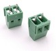         | Borne de entrada                                                                                                                                                                                                                                                                                                                                                                                                                                                                                                                                                                                                                                                                                      | KF128-MINI, 2 vias                                                   |     1      |
|     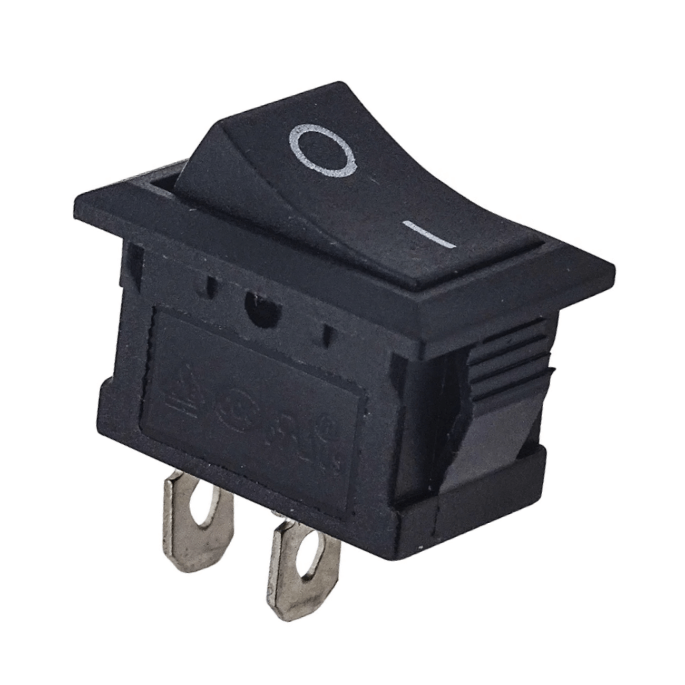     | [Interruptor gangorra](https://pt.aliexpress.com/item/1005009248936075.html)                                                                                                                                                                                                                                                                                                                                                                                                                                                                                                                                                                                                                          | KCD11, liga/desliga da alimentação                                   |     1      |
|                           -                            | Chave tátil                                                                                                                                                                                                                                                                                                                                                                                                                                                                                                                                                                                                                                                                                           | 12D00G ou equivalente                                                |     1      |
|                           -                            | [Placa de circuito impresso](https://jlcpcb.com/)                                                                                                                                                                                                                                                                                                                                                                                                                                                                                                                                                                                                                                                     | <i>PCB</i> do dispositivo embarcado                                  |     5      |

<p align="right">(<a href="#topo">voltar ao topo</a>)</p>

## Esquema Elétrico do Dispositivo

A tabela abaixo separa o esquema elétrico total do dispositivo embarcado em diferentes partes, de acordo com a função de cada uma. Na prática, todas funcionam em conjunto em uma única placa de circuito impresso (<i>PCB</i>).

|                                                      Esquema Elétrico                                                      | Função no Dispositivo                                                                                                                                                                             |
| :------------------------------------------------------------------------------------------------------------------------: | :------------------------------------------------------------------------------------------------------------------------------------------------------------------------------------------------ |
|             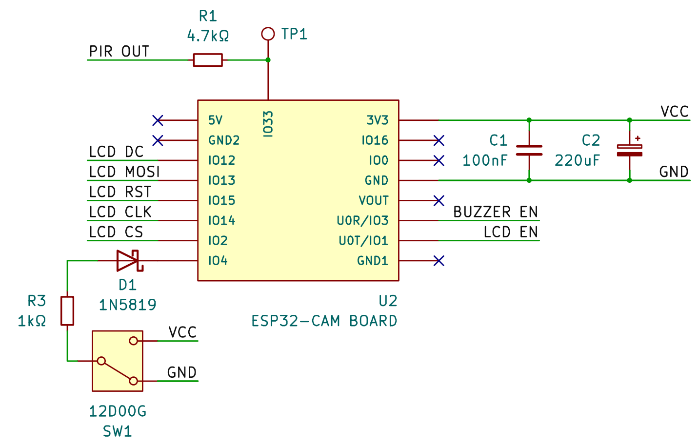<br><sub>Microcontrolador</sub>             | Atua como o "cérebro" do dispositivo. É responsável por executar o <i>firmware</i>, processar cálculos lógicos, receber dados dos sensores e enviar comandos para o <i>display</i> e indicadores. |
| 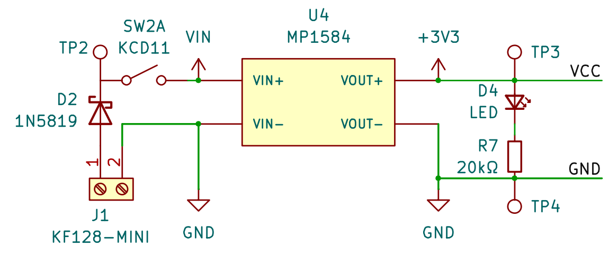<br><sub>Fonte de Alimentação (<i>Power Source</i>)</sub> | Gerencia a energia do sistema. Recebe a energia externa e a converte/regula para 3.3V a fim de alimentar todos os componentes de forma segura e estável.                                          |
|            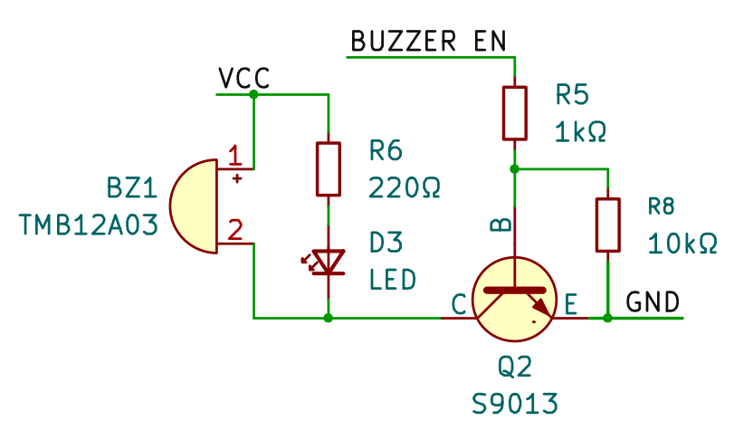<br><sub>Indicador Visual (<i>Status</i>)</sub>            | Fornece <i>feedback</i> visual e sonoro simples e rápido sobre o estado operacional do dispositivo. O <i>LED</i> verde é interpretado como um sinal positivo.                                     |
|                 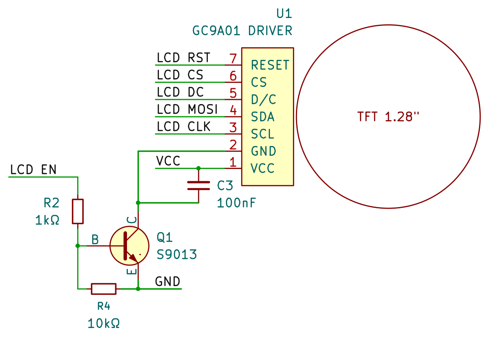<br><sub><i>Display TFT</i></sub>                 | Interface gráfica do sistema. Utilizada para exibir informações mais detalhadas ao usuário e imagens da câmera em tempo real.                                                                     |
|                        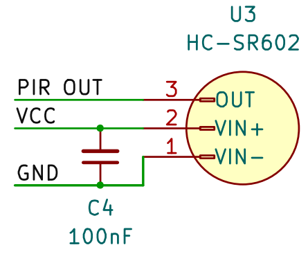<br><sub><i>Sensor</i></sub>                         | Envia para o microcontrolador um sinal de usuário fisicamente presente/próximo ao dispositivo. Serve para ligá-lo ou retirar do modo de espera.                                                   |

<p align="right">(<a href="#topo">voltar ao topo</a>)</p>

## Objetivos Específicos

- Identificar o dispositivo pelo <i>MAC eFuse</i> do <i>ESP32</i>;
- Conectar ao <i>Wi-Fi</i> e ao <i>broker MQTT</i> configurados em <i>build time</i>;
- Buscar no <i>EdgeNode</i> o contexto de aula/chamada atual;
- Exibir <i>preview</i> da câmera ou mensagens de estado no <i>TFT</i>;
- Enviar <i>frames JPEG</i> periodicamente enquanto existe chamada ativa;
- Receber <i>feedback</i> de autenticação pelo <i>MQTT</i>;
- Publicar <i>status</i>, métricas de saúde e eventos de presença;
- Economizar energia quando não há movimento detectado pelo <i>PIR</i>.

<p align="right">(<a href="#topo">voltar ao topo</a>)</p>

## Fluxo de Execução

`src/main.cpp` é o ponto de entrada.

1. Desativa <i>brownout</i>, configura pinos e marca o estado `BOOTING`.
2. Gera `deviceId` a partir do <i>MAC eFuse</i> do <i>ESP32</i>.
3. Inicializa <i>TFT</i>, <i>sprites</i> de desenho, <i>sleep</i> e câmera.
4. Cria tarefas <i>FreeRTOS</i> para <i>display</i>, câmera, rede e <i>MQTT</i>.
5. No `loop()`, expira o contexto de aula, processa <i>PIR</i>, aciona <i>feedback</i> positivo,
   entra/sai de <i>idle</i> e dispara <i>deep sleep</i> quando aplicável.

As tarefas principais rodam em paralelo:

- `TaskDisplay`: desenha mensagens, <i>preview</i> da câmera e informações de contexto.
- `TaskCamera`: captura <i>frames</i> da câmera, alimenta <i>preview</i> e <i>snapshots REST</i>.
- `TaskNetwork`: conecta <i>Wi-Fi</i>, busca contexto <i>REST</i> e envia <i>frames JPEG</i>.
- `TaskMqtt`: conecta ao <i>broker</i>, assina comandos e publica <i>status</i>/métricas.

<p align="right">(<a href="#topo">voltar ao topo</a>)</p>

## Estados do Dispositivo

Os estados ficam em `include/Globals.h`:

- `BOOTING`: inicialização local.
- `NET_OFF`: <i>Wi-Fi</i> desconectado.
- `MQTT_OFF`: <i>Wi-Fi</i> ativo, <i>MQTT</i> desconectado.
- `FETCHING`: precisa buscar contexto de aula no <i>REST</i>.
- `WORKING`: contexto válido e operação normal.
- `WAITING_SERVER`: <i>frame</i> enviado, aguardando retorno pelo <i>MQTT</i> ou <i>timeout</i>.
- `SLEEPING`: preparando <i>deep sleep</i>.

`setState()` em `src/Globals.cpp` também publica <i>status MQTT</i> retido quando o
<i>broker</i> está conectado:

- `working`
- `fetching`
- `sleep`

A figura abaixo ilustra a máquina de estados do dispositivo embarcado:

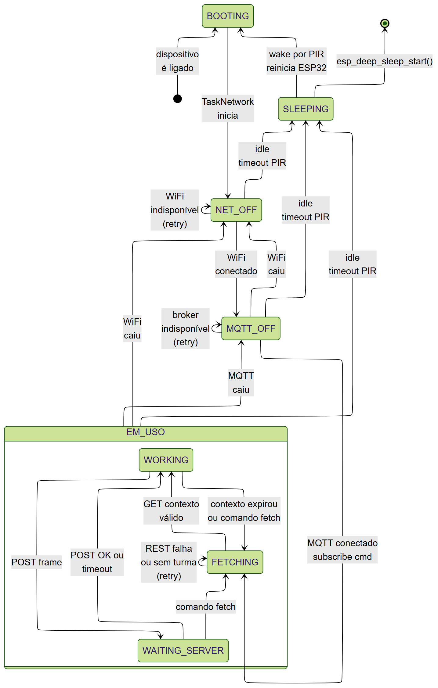

<p align="right">(<a href="#topo">voltar ao topo</a>)</p>

## Dependências do <i>Firmware</i>

- <i>Framework</i>: Arduino sobre <i>ESP32</i> via <i>PlatformIO</i>
- Comunicação: <i>Wi-Fi</i>, <i>HTTP REST</i> e <i>MQTT</i>

| Dependência                                                         | Descrição                                                                                                                                                                                                  |
| :------------------------------------------------------------------ | :--------------------------------------------------------------------------------------------------------------------------------------------------------------------------------------------------------- |
| [bodmer/TFT_eSPI](https://github.com/Bodmer/TFT_eSPI)               | Biblioteca gráfica e de fontes altamente otimizada para <i>displays TFT</i> baseados em <i>SPI</i>, focada em microcontroladores como <i>ESP8266</i>, <i>ESP32</i> e <i>RP2040</i>.                        |
| [bitbank2/JPEGDEC](https://github.com/bitbank2/JPEGDEC)             | Decodificador <i>JPEG</i> otimizado para microcontroladores (escrito em C/C++), permitindo carregar e exibir imagens em <i>displays</i> com uso eficiente de memória.                                      |
| [bblanchon/ArduinoJson](https://github.com/bblanchon/ArduinoJson)   | Biblioteca de C++ eficiente e poderosa para serialização e desserialização de dados no formato <i>JSON</i>, muito utilizada em projetos Arduino e <i>IoT</i>.                                              |
| [knolleary/PubSubClient](https://github.com/knolleary/pubsubclient) | Biblioteca para Arduino que fornece um cliente para o protocolo <i>MQTT</i> (<i>Message Queuing Telemetry Transport</i>), permitindo publicar e assinar tópicos para comunicação <i>IoT</i> em tempo real. |

<p align="right">(<a href="#topo">voltar ao topo</a>)</p>

## Placa de Circuito Impresso

Os circuitos eletrônicos do dispositivo são desenhados em uma placa de circuito impresso (PCB). Abaixo está o modelo 3D da PCB.

- [Clique neste LINK para visualizar em 3D](https://3dviewer.net/index.html#model=https://raw.githubusercontent.com/DanielKGM/autoponto-firmware/refs/heads/main/assets/pcb/autoponto_circuit.wrl) &middot; [Arquivo Gerber](https://github.com/DanielKGM/autoponto-firmware/tree/main/assets/pcb)

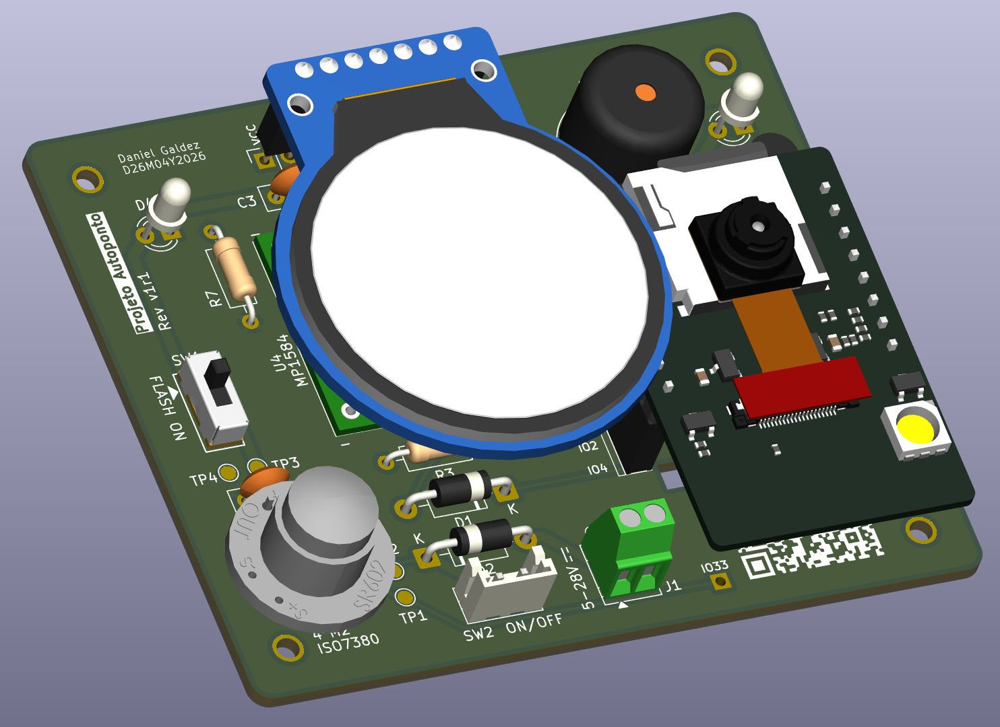

<p align="right">(<a href="#topo">voltar ao topo</a>)</p>

## Caixa de Montagem

Para testes em campo, os componentes eletrônicos e PCB precisam ser protegidos por uma caixa de montagem. A figura abaixo mostra o modelo 3D da caixa, que pode ser impresso em <i>PLA</i> ou outro material resistente.

- Clique nos LINKS a seguir para visualizar os arquivos de impressão: [BASE](https://3dviewer.net/index.html#model=https://raw.githubusercontent.com/DanielKGM/autoponto-firmware/refs/heads/main/assets/modelos_3d/ap_base.stl) &middot; [TAMPA](https://3dviewer.net/index.html#model=https://raw.githubusercontent.com/DanielKGM/autoponto-firmware/refs/heads/main/assets/modelos_3d/ap_tampa.stl) &middot; [TAMPA (SEM LOGO)](https://3dviewer.net/index.html#model=https://raw.githubusercontent.com/DanielKGM/autoponto-firmware/refs/heads/main/assets/modelos_3d/ap_tampa_semlogo.stl)

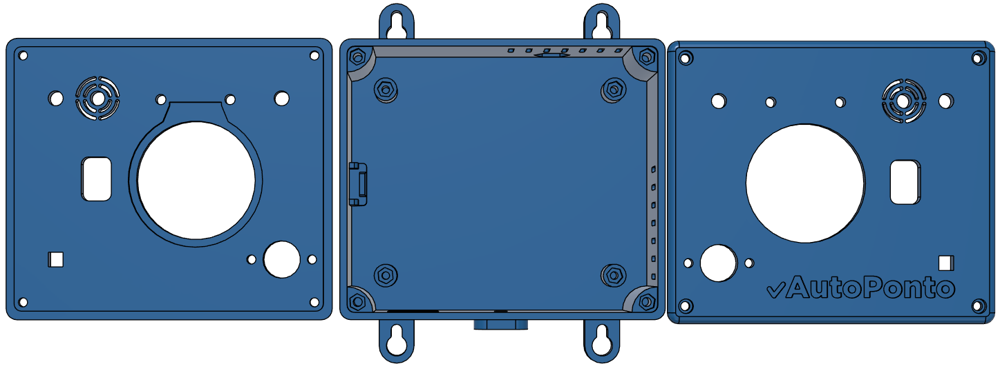

<p align="right">(<a href="#topo">voltar ao topo</a>)</p>

## Fotos em Funcionamento

|                                                                                                               |                                                                                                                                                |
| :-----------------------------------------------------------------------------------------------------------: | :--------------------------------------------------------------------------------------------------------------------------------------------: |
|      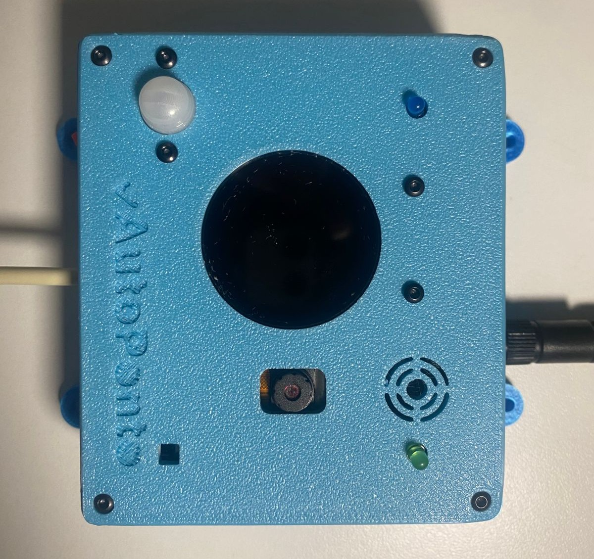<br><sub>Dispositivo montado, não energizado</sub>       |                        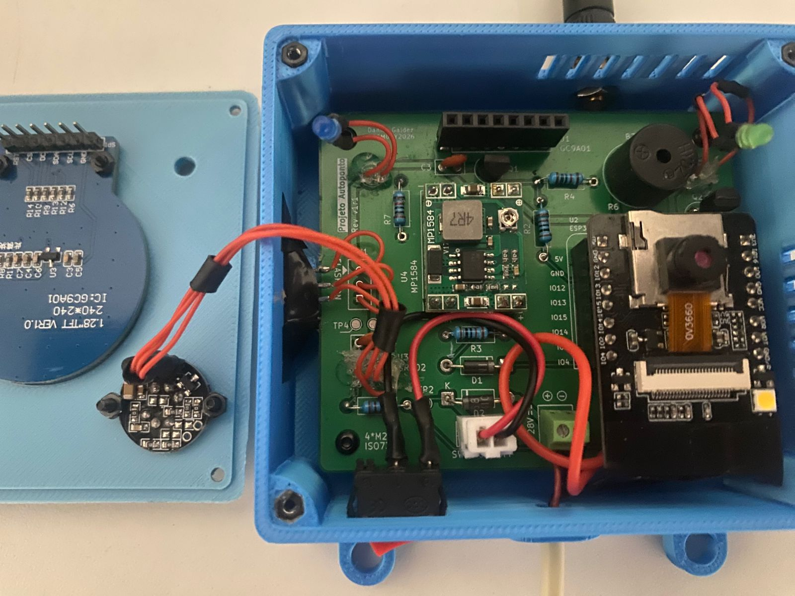<br><sub>Por dentro do dispositivo embarcado</sub>                        |
|   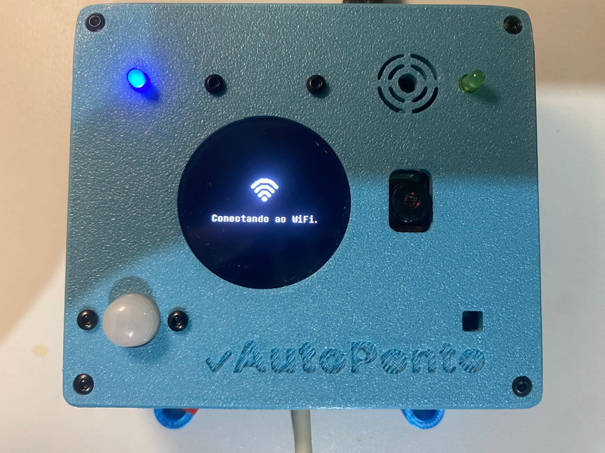<br><sub>Tentativa de conexão <i>Wi-Fi</i></sub>    |                      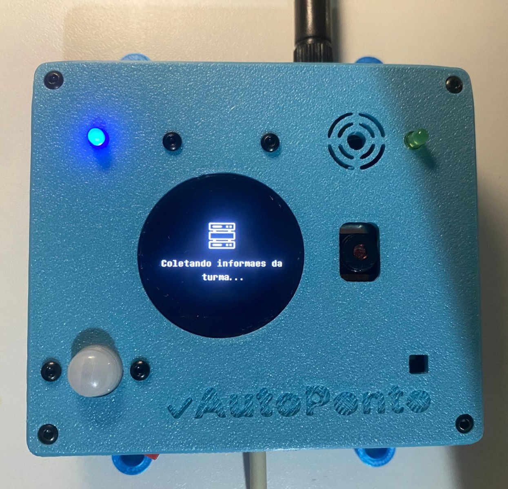<br><sub>Buscando contexto das aulas</sub>                      |
|             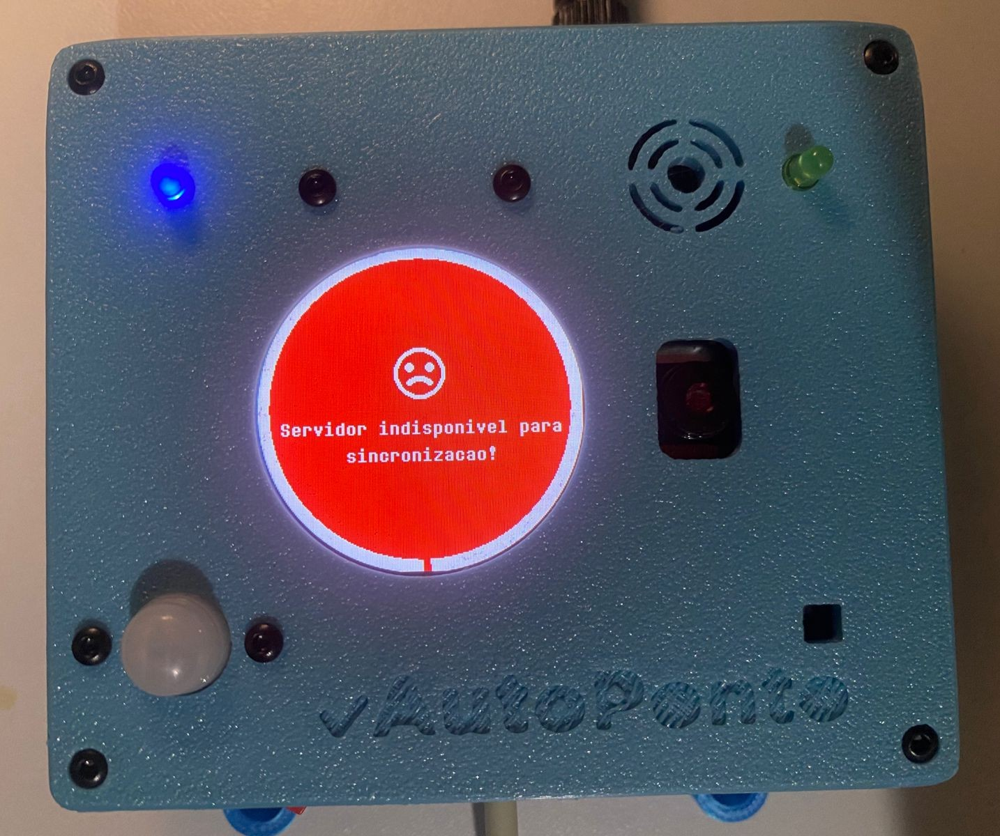<br><sub>Exibindo mensagem de erro</sub>             |     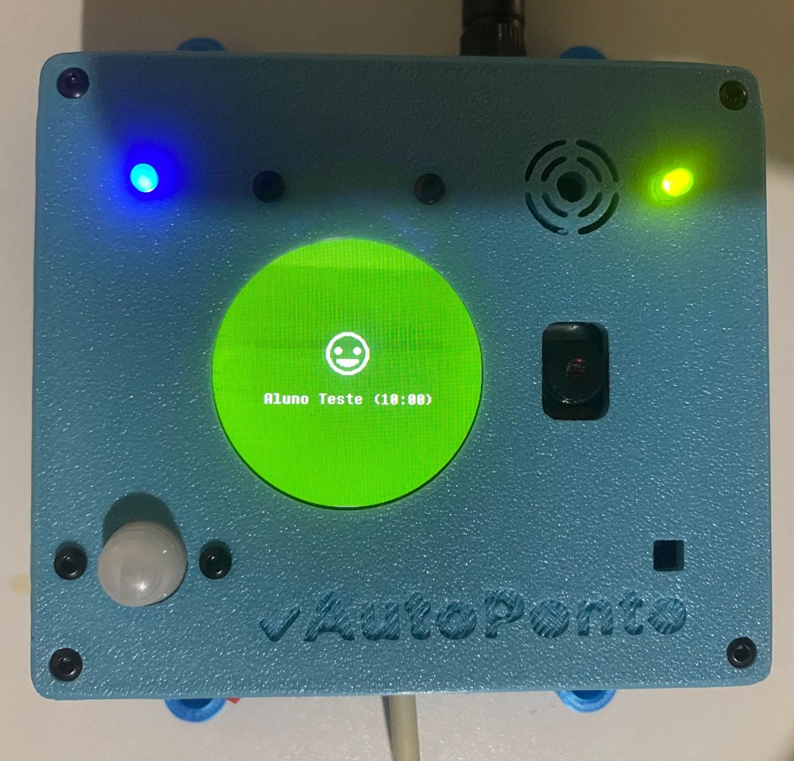<br><sub>Exibindo <i>feedback</i> positivo após reconhecimento facial</sub>      |
| 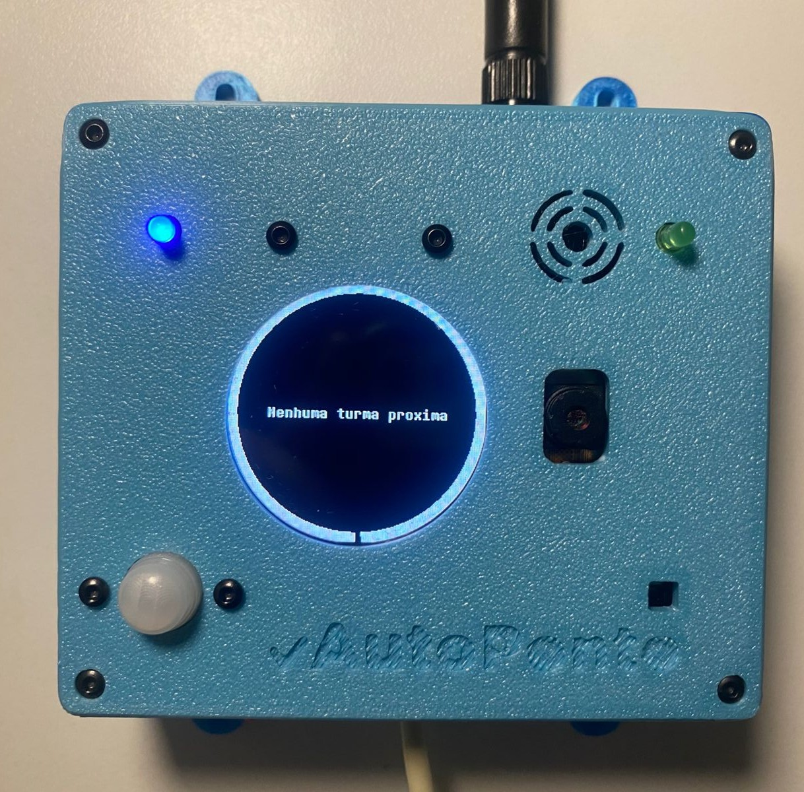<br><sub>Em funcionamento, mas sem turmas próximas</sub> | 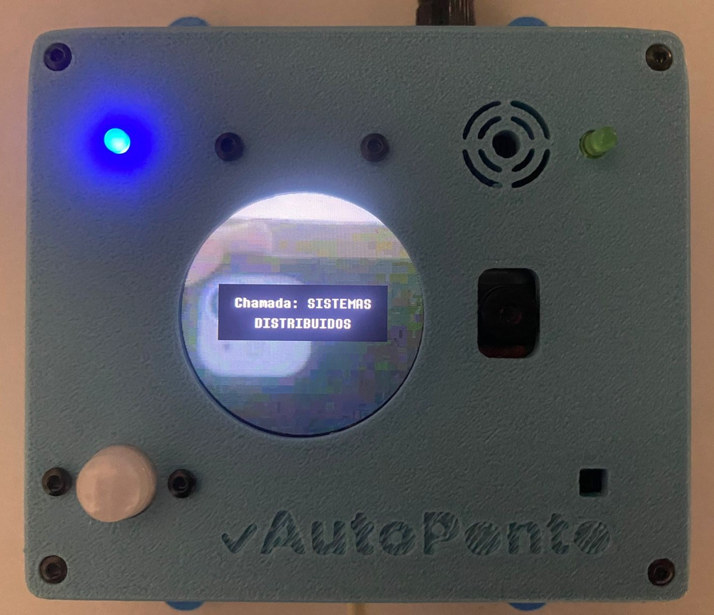<br><sub>Em funcionamento normal: informações da turma e <i>feedback</i> da câmera</sub> |

<p align="right">(<a href="#topo">voltar ao topo</a>)</p>

## Configuração Local

O código inclui `Config.h`, mas esse arquivo não deve ser versionado. Ele fica
em `include/Config.h` e está ignorado pelo <i>Git</i> porque contém credenciais,
endereços e parâmetros de ambiente.

Para preparar um ambiente local:

```powershell
Copy-Item Config_Model.h include\Config.h
```

Depois edite `include/Config.h` com os valores reais:

- `WIFI_SSID` e `WIFI_PASS`
- `REST_URL`, `REST_PASS`, `REST_POST_PATH`, `REST_FETCH_PATH`
- `MQTT_URL`, `MQTT_PORT`, `MQTT_USER`, `MQTT_PASS`

`Config_Model.h` também documenta os parâmetros fixos de <i>build</i>, como pinos,
<i>timeouts</i>, intervalo de <i>POST REST</i>, intervalo de métricas <i>MQTT</i>, tamanho do <i>display</i>
e duração do <i>feedback</i> positivo. Não coloque credenciais reais no README nem em
arquivos versionados.

<p align="right">(<a href="#topo">voltar ao topo</a>)</p>

## Mapa de Arquivos

```text
.
|-- platformio.ini              Configuração PlatformIO, board, libs e build flags TFT
|-- Config_Model.h              Modelo de configuração local sem segredos
|-- README.md                   Este guia
|-- docs/
|   |-- FSM_DIAGRAM.mmd         Diagrama Mermaid da máquina de estados
|   `-- FSM_DIAGRAM.png         Render do diagrama
|-- include/
|   |-- Camera.h                API da câmera e FrameBuffer
|   |-- Config.h                Config local ignorada pelo Git
|   |-- Config_Camera.h         Pinos e parâmetros da câmera
|   |-- Display.h               API do display e ícones
|   |-- Font.h                  Fonte customizada usada no TFT
|   |-- Globals.h               Estados, contexto, tasks e métricas compartilhadas
|   |-- Icons.h                 Declarações dos ícones RGB565
|   |-- MQTT.h                  API MQTT, tópicos e limites de payload
|   |-- Network.h               API Wi-Fi/REST
|   `-- Power.h                 API de energia, PIR, idle e feedback
`-- src/
    |-- Camera.cpp              Inicialização/captura da câmera e filas de frame
    |-- Display.cpp             Renderização TFT, mensagens e preview
    |-- Globals.cpp             Estado global, contexto, métricas e helpers
    |-- Icons.cpp               Bitmaps RGB565 dos ícones
    |-- MQTT.cpp                Conexão MQTT, comandos, status e métricas
    |-- Network.cpp             Wi-Fi, fetch de contexto e POST de frames
    |-- Power.cpp               Pinos, PIR, idle, feedback e deep sleep
    `-- main.cpp                Bootstrap, criação das tasks e loop principal
```

<p align="right">(<a href="#topo">voltar ao topo</a>)</p>

## Contexto de Aula

O contexto compartilhado é `AttendanceContext`:

```cpp
struct AttendanceContext
{
    char lesson_name[LESSON_NAME_LENGTH];
    uint64_t msForNext;
    uint64_t msRemaining;
    TickType_t fetchTick;
};
```

Campos esperados do <i>endpoint REST</i> de contexto:

- `lesson_name`: nome da turma/aula.
- `msForNext`: tempo até a próxima chamada.
- `msRemaining`: tempo restante da chamada atual.

`fetchTick` é o instante local em que o contexto foi recebido. O <i>display</i>,
expiração no `loop()` e telemetria devem usar esse mesmo ponto de referência
para evitar divergência entre <i>UI</i>, validade do contexto e métricas.

Quando `msForNext == 0` e `msRemaining == 0`, o <i>firmware</i> trata como ausência de
turma próxima, limpa o contexto e segue tentando buscar novamente em intervalo
controlado.

<p align="right">(<a href="#topo">voltar ao topo</a>)</p>

## Contrato <i>REST</i>

`src/Network.cpp` concentra o tráfego <i>HTTP</i>.

### Buscar Contexto

Requisição:

- método: `GET`
- <i>URL</i>: `REST_URL + REST_FETCH_PATH`
- <i>headers</i>:
  - `X-Device-Id: <deviceId>`
  - `X-Auth: <REST_PASS>`

Resposta esperada:

```json
{
  "lesson_name": "Nome da turma",
  "msForNext": 0,
  "msRemaining": 300000
}
```

### Enviar <i>Frame</i>

Requisição:

- método: `POST`
- <i>URL</i>: `REST_URL + REST_POST_PATH`
- <i>body</i>: <i>JPEG</i> cru capturado pela câmera
- <i>headers</i>:
  - `Content-Type: image/jpeg`
  - `X-Device-Id: <deviceId>`
  - `X-Auth: <REST_PASS>`
  - `Connection: close`

O envio só acontece quando:

- o dispositivo está em `WORKING`;
- há chamada ativa (`context.msRemaining > 0`);
- o dispositivo não está em <i>idle</i>;
- não há mensagem <i>fullscreen</i> ativa no <i>display</i>.

Depois do <i>POST</i> bem-sucedido, o estado passa para `WAITING_SERVER`. Se não chegar
<i>feedback MQTT</i> dentro de `RESPONSE_WAIT_TIMEOUT_MS`, volta para `WORKING`.

<p align="right">(<a href="#topo">voltar ao topo</a>)</p>

## Contrato <i>MQTT</i>

`src/MQTT.cpp` concentra tópicos, conexão e <i>payloads</i>.

O `deviceId` tem 12 caracteres hexadecimais derivados do <i>MAC eFuse</i>. A partir
dele, os tópicos são:

- comandos: `cmd/{deviceId}`
- <i>logs</i>/<i>status</i>/telemetria: `log/{deviceId}`

### <i>Status</i>

O <i>firmware</i> publica <i>status</i> retido em `log/{deviceId}`:

```json
{ "kind": "status", "status": "working" }
```

O <i>Last Will and Testament</i> também usa `log/{deviceId}` com <i>payload</i> retido:

```json
{ "kind": "status", "status": "offline" }
```

<p align="right">(<a href="#topo">voltar ao topo</a>)</p>

### Métricas

A cada `MQTT_LOG_INTERVAL_MS`, publica `kind=metrics` sem <i>retain</i>:

```json
{
  "kind": "metrics",
  "idle": false,
  "heap_free": 0,
  "heap_min": 0,
  "heap_max": 0,
  "psram_free": 0,
  "psram_min": 0,
  "psram_max": 0,
  "rssi": 0,
  "post_max_ms": 0,
  "avg_us": {
    "loop": 0,
    "mqtt": 0,
    "network": 0,
    "camera": 0,
    "display": 0
  },
  "avg_count": {
    "loop": 0,
    "mqtt": 0,
    "network": 0,
    "camera": 0,
    "display": 0
  }
}
```

<p align="right">(<a href="#topo">voltar ao topo</a>)</p>

## Contato

[Daniel Galdez (LINKEDIN)](https://www.linkedin.com/in/daniel-campos-galdez-monteiro/) &middot; <a href="mailto:danielgaldez10@hotmail.com?subject=AUTOPONTO&body=Olá! Vim do repositório AUTOPONTO e ...">danielgaldez10@hotmail.com</a>

<p align="right">(<a href="#topo">voltar ao topo</a>)</p>

## Licença e Citação

<p align="justify">Este projeto é protegido por direitos autorais (<i>All Rights Reserved</i>). A cópia, distribuição, uso comercial ou modificação não são permitidas sem autorização prévia. Para mais informações, consulte o arquivo <b>LICENSE.md</b> ou a <b>aba de licença</b> do repositório.<br/><br/>Caso utilize este projeto em trabalhos acadêmicos ou científicos, utilize a seguinte referência BibTeX:</p>

```Latex
@software{AutoPonto_2026,
  author  = {Campos Galdez Monteiro, Daniel},
  month   = jul,
  title   = {{AutoPonto: Chamadas Acadêmicas por Reconhecimento Facial}},
  url     = {https://github.com/DanielKGM/autoponto-firmware},
  version = {1.0.0},
  year    = {2026}
}
```

<p align="right">(<a href="#topo">voltar ao topo</a>)</p>

<!-- ACKNOWLEDGMENTS -->

## Agradecimentos

<p align="justify">Agradeço a todos os professores do curso de Engenharia da Computação pela Universidade Federal do Maranhão (UFMA), pelos conhecimentos indispensáveis para realização desse projeto. Em especial, agradeço aos membros da minha bancada de TCC pela disponibilidade e paciência para avaliar este projeto com a nota máxima, e ao meu orientador Prof. Dr. Luis Henrique Neves Rodrigues.</p>

<p align="right">(<a href="#topo">voltar ao topo</a>)</p>

<!-- MARKDOWN LINKS & IMAGES -->
<!-- https://www.markdownguide.org/basic-syntax/#reference-style-links -->

[doi-shield]: https://img.shields.io/badge/DOI-10.5281/zenodo.21705236-black?style=for-the-badge
[doi-url]: https://doi.org/10.5281/zenodo.21705236
[contributors-shield]: https://img.shields.io/github/contributors/DanielKGM/autoponto-firmware.svg?style=for-the-badge
[contributors-url]: https://github.com/DanielKGM/autoponto-firmware/graphs/contributors
[forks-shield]: https://img.shields.io/github/forks/DanielKGM/autoponto-firmware.svg?style=for-the-badge
[forks-url]: https://github.com/DanielKGM/autoponto-firmware/network/members
[stars-shield]: https://img.shields.io/github/stars/DanielKGM/autoponto-firmware.svg?style=for-the-badge
[stars-url]: https://github.com/DanielKGM/autoponto-firmware/stargazers
[issues-shield]: https://img.shields.io/github/issues/DanielKGM/autoponto-firmware.svg?style=for-the-badge
[issues-url]: https://github.com/DanielKGM/autoponto-firmware/issues
[license-shield]: https://img.shields.io/github/license/DanielKGM/autoponto-firmware.svg?style=for-the-badge
[license-url]: https://github.com/DanielKGM/autoponto-firmware/blob/main/LICENSE.md
[linkedin-shield]: https://img.shields.io/badge/-LinkedIn-black.svg?style=for-the-badge&logo=linkedin&colorB=555
[linkedin-url]: https://www.linkedin.com/in/daniel-campos-galdez-monteiro/

<!-- BADGES TABELA-->
